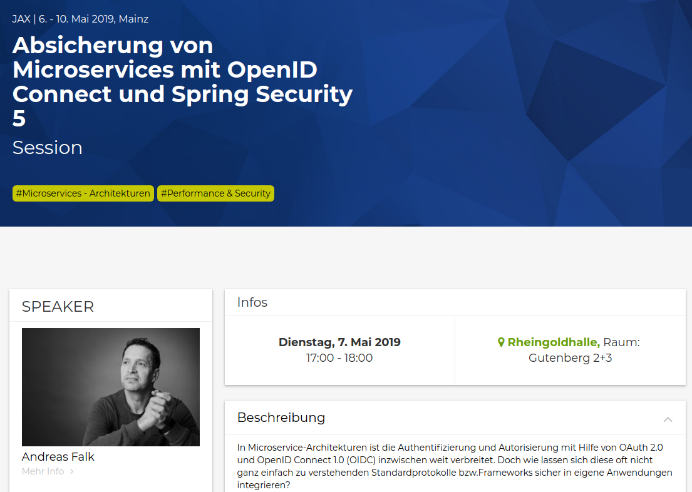

# JAX 2019 (Mainz/Germany 07.05.2019)

Talk and demos for [JAX conference talk](https://jax.de/microservices/absicherung-von-microservices-mit-openid-connect-und-spring-security-5/) in Mainz on 07.05.2019 on the topic

"_Absicherung von Microservices mit OpenID Connect und Spring Security 5_"

This talk contains the following parts:

1. Introduction to OAuth 2 and OpenID Connect 1.0
2. Discussions and Best Practices in OAuth 2.0 & OIDC
3. Live Coding Demo for OAuth 2.0 & OpenID Connect with Spring Security 5

## Presentation

[Presentation Slides (HTML5)](https://andifalk.github.io/jax-2019-openid-connect-spring-security/index.html)

## Live Code Demo

[Live Code Demo](live-demos)
